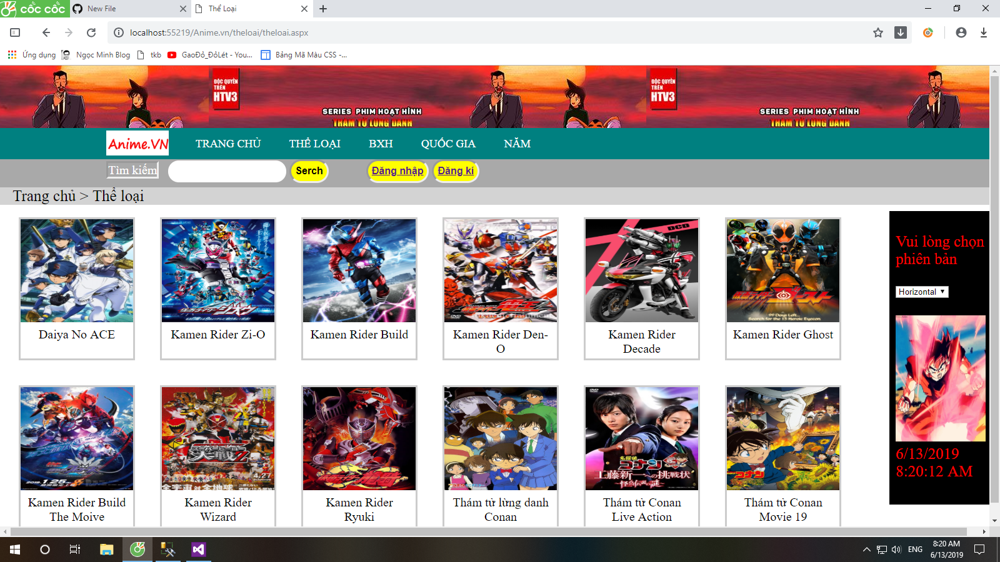
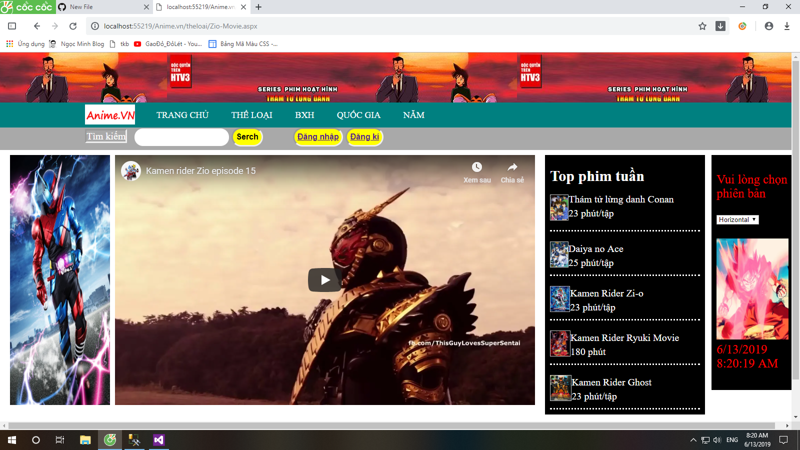
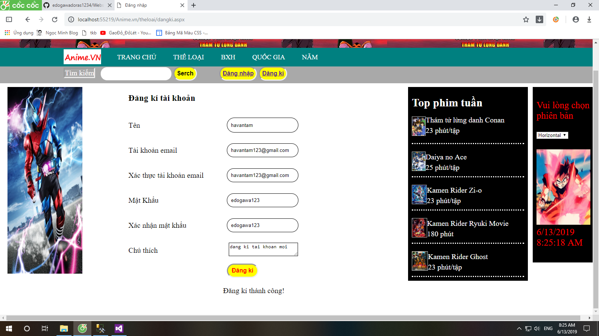

<h1>Bài tập web ASP.net</h1>
<h2>Chủ đề web hoạt hình Anime.vn<h2>
<h3> Đây là trang web về các loại phim anime theo nhiều thể loại, năm sản xuất, quốc gia và có các bảng xếp hạng về phim </h3>
<h3> Có 2 giao diện người dùng, ta có thể thay đổi tùy theo ý thích của mình </h3>

<i> Khi click vào thể loại, sẽ có rất nhiều phim hiện ra </i>

<i>và khi click vào một bộ phim nào đó, sẽ hiện lên thông tin chi tiết của phim </i>

<i>Click vào ảnh của phim để xem phim</i>

<h2>Tiếp theo sẽ là phần đăng kí</h2>

<i>Nếu tài khoản đã tồn tại, trang sẽ thông báo tài khoản tồn tại</i>

<i>Và nếu chưa có tài khoản thì trang sẽ thông báo đăng kí thành công</i>

<i>Khi bấm nút đăng kí, dữ liệu sẽ được thêm vào bảng TaiKhoan trong cơ sở dữ liệu</i>

<i> Khi bấm vào nút đăng nhập, tài khoản và mật khẩu sẽ được so sánh với dữ liệu trong bảng TaiKhoan</i>

<i> Nếu dữ liệu đúng, thông báo đăng nhập thành công, dữ liệu sai, sẽ thông báo sai tài khoản/mật khẩu</i>

<i> Đăng nhập đúng sẽ đăng nhập thành công</i>

<i> Khi người dùng quên mật khẩu, ta có thể click vào quên mật khẩu để lấy lại mật khẩu đã quên, nó sẽ update mật khẩu trong bảng TaiKhoan</i>

<i> Đúng tài khoản, sẽ đổi thành công, nếu tài khoản sai thì báo tài khoản không đúng</i>

